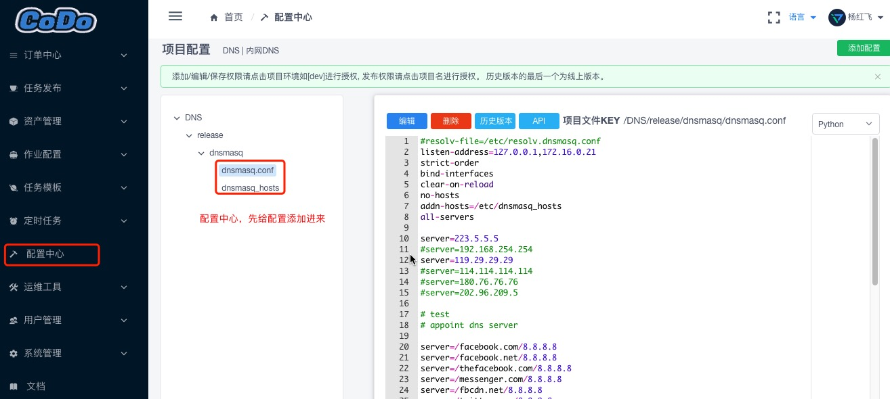
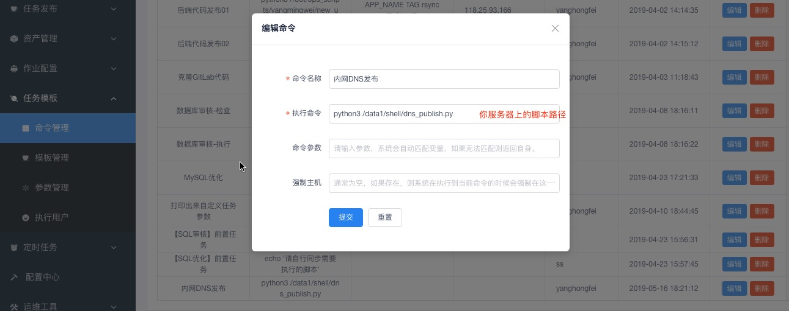
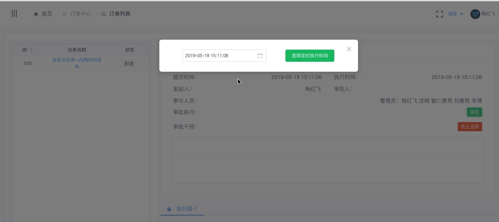
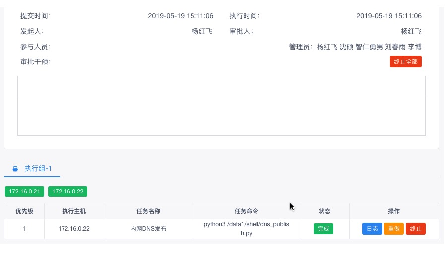
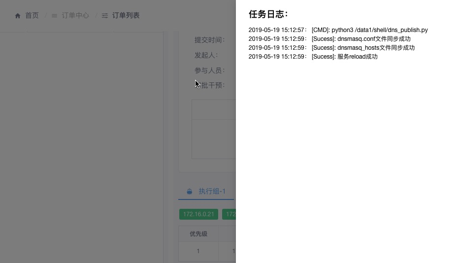

基于配置中心管理内网Dnsmasq示例

### 基于配置中心管理dnsmasq示例

> 这是一篇关于如何基于配置中心来图形化管理你的内网DNS，一般来说互联网企业里面都会部署自己内部的DNS服务，来提升解析速度。本示例dnsmasq，关于bind DNS域名管理是平台的一个单独模块。

**环境说明**

> Q: 为什么要配置到平台上？
>
> A：假如你内网DNS有多台，即使是管理简单的dnsmasq服务，你也要手动登录机器进行编辑配置文件，很麻烦，机器上直接操作是非常危险的，且没有回滚功能，一不小心就可能导致出错，Server 挂掉等。所以在此借助配置中心模块简单记录下，配置中心支持图形化操作、对比、回滚等操作

- OpenDevOps平台
- 配置中心模块
- 任务模板
- 内网DNS服务(dnsmasq)


**如何使用**

**开始之前你可以点击以下链接看下最终效果，看此操作是否可以满足你的需求**

[Youtube](https://www.youtube.com/watch?v=jM8DSbUh0Rs&t=47s) | [Youku](https://v.youku.com/v_show/id_XNDE4Nzg4NDUyNA==.html?spm=a2h3j.8428770.3416059.1)


**登录配置中心新建一个项目**



**对项目进行赋权**

新建的项目默认只有创建人才有权限， 需要赋权，其余用户才可以看到/拉取配置文件详情


**获取一个用户的长期Token**

这个用户必须有你这个项目的权限才可以，然后获取到这个用户的长期Token，后面脚本要用到


**服务器上拉取配置**

这里需要在服务器上放一个拉取配置中心配置的一个脚本，逻辑就是，通过一个有权限的用户—拉取指定的配置信息—将配置同步到你的server上—-reload服务

这里提供一个配置脚本示例(dnsmasq)，更详情的脚本可参考[配置中心](https://github.com/opendevops-cn/kerrigan/blob/master/libs/get_config.py)

示例脚本放到DNS服务器目录：`/data1/shell/dns_publish.py`

```python
#!/usr/bin/env python
# -*-coding:utf-8-*-
"""
Contact : 191715030@qq.com
Author  : shenshuo
Date    : 2019/1/29
Desc    : 获取配置文件内容，
          要确保有全局权限 /kerrigan/v1/conf/publish/
          要确保有当前项目配置获取权限
"""

import os
import requests
import json
import subprocess


def exec_shell(cmd):
    '''执行shell命令函数'''
    sub2 = subprocess.Popen(cmd, shell=True, stdout=subprocess.PIPE, stderr=subprocess.STDOUT)
    stdout, stderr = sub2.communicate()
    ret = sub2.returncode
    return ret,stdout.decode('utf-8').strip()


class ConfApi:
    def __init__(self):
        # self.auth_key 是一个长期Token，基于用户管理里面，管理员选中用户生成长期Token，默认发送到用户邮箱
        self.auth_key = 'eyJ0eXAiOiJKV1QiLCJhbmZpZyIsIm5pY2XcFBbGciOiJIUzI1NiJ9.eyJleHAiOjE2NTMwMzQyNzYsIm5iZiI6MTU1Nzk5NDI1NiwiaWF0IjoxNTU3OTk0Mj3ZjZlXHU3NTI4XHU2MjM3IY2LCJpc3MiOiJhdXRoOiBzcyIsInN1YiI6Im15IHRva2VuIiwiaWQiOiIxNTYxODcxODA2MCIsImRhdGEiOnsidXNlcl9pZCI6NjYsInVzZXJuYW1lIjoiZ2V0X2NvFOOo'
        self.conf_path ='/tmp'
        self.conf_config_api = "https://codo.domain.com/api/kerrigan/v1/conf/publish/config/"   #配置中心获取API


    def get_config_details(self, project_code, environment, service, filename):
        # 获取配置文件内容,  2019-04-28支持URL auth_key登陆，不需要再登陆进行获取auth_key，直接生成长期Token用
        #__token = self.login()

        __token = self.auth_key
        try:
            _params = {'project_code': project_code, 'environment': environment,'service':service,'filename':filename, 'auth_key': __token}
            res = requests.get(self.conf_config_api, params=_params)
            ret = json.loads(res.content)
            if ret['code'] == 0: return ret['data']
        except Exception as e:
            print('[Error:] 发布配置接口连接失败，错误信息：{}'.format(e))
            exit(-2)


    def create_config_file(self, project_code, environment, service, filename):
        # 生成配置文件
        config_data = self.get_config_details(project_code, environment, service, filename)
        for k,v in config_data.items():
            config_file = self.conf_path + k
            dir_name, _ = os.path.split(config_file)
            if not os.path.exists(dir_name):
                os.makedirs(dir_name)
            with open(config_file ,'w') as f:
                f.write(v)
        #     print('config file path is {}'.format(config_file))
        # print('success')
        return config_file  #返回文件路径


    def rsync_file(self, config_file):
        """
        同步文件
        :return:
        """
        #目标文件名：
        target_file_name = config_file.split('/')[-1]
        cmd = 'rsync -avz {}  /etc/{}'.format(config_file,target_file_name)
        ret, stdout = exec_shell(cmd)
        if ret != 0:
            print('[ERROR]: 文件同步失败'.format(target_file_name))
            return False
        print('[Sucess]: {}文件同步成功'.format(target_file_name))

    def reload_service(self):
        cmd = 'service dnsmasq reload'
        ret, stdout = exec_shell(cmd)
        if ret != 0:
            print('[ERROR]: 服务启动失败')
            return False
        print('[Sucess]: 服务reload成功')


def main():
    obj = ConfApi()
    config_file = obj.create_config_file('DNS', 'release', 'dnsmasq', 'dnsmasq.conf')
    hosts_config_file = obj.create_config_file('DNS', 'release', 'dnsmasq', 'dnsmasq_hosts')
    if config_file:
        obj.rsync_file(config_file)

    if hosts_config_file:
        obj.rsync_file(hosts_config_file)

    obj.reload_service()

if __name__ == '__main__':
    main()
```

运行查看结果：

```python
python3 /data1/shell/dns_publish.py
[Sucess]: dnsmasq.conf文件同步成功
[Sucess]: dnsmasq_hosts文件同步成功
[Sucess]: 服务reload成功
```

其实到了这一步，基本配置已经完成了，由于这个DNS每次修改后配置都要reload服务，所以不建议放到crontab里面进行轮训配置，接下来配置下发布，IT人员修改后配置，点下发布进行触发


**配置DNS发布**


**新建一个Tag，将机器添加进去**


**新建命令和模板配置**

这里是发布的时候选择我们自己排序的模块任务




**提交一个自定义任务**


**审批任务**




**执行结果**



如果出错可以查看日志进排查，也可以重做，终止等操作




