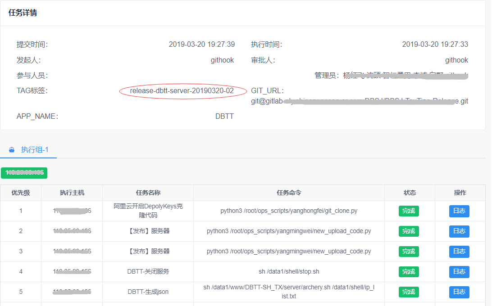

### 基于任务平台实现Git发布示例


**环境**

> 本章节实验环境主要基于`GitLab Custom Hooks`和`GitLab Tag`借助opendevops平台实现自动化发布，以下为所用到的功能简单介绍。
  
  
你需要具备以下环境：
  
  
- [GitLab](https://github.com/gitlabhq/gitlabhq/blob/master/doc/install/README.md)
- [GitLab Hooks](http://yanghongfei.me/2019/03/25/git-hooks/)
- [GitLab Depoly Keys](http://yanghongfei.me/2019/03/19/gitlab-api-enable-depoly-key/)
- [OpenDevOps 开源自动化运维平台](http://www.opendevops.cn/)


**发布为什么选择过OpenDevOps平台**

- 进度可视化
- 平台发布记录
- Git Tag 可快速回滚
- 权限控制，可由PM登陆平台审核后发布
- 可定时执行，报错可重装，不同项目需求可根据实际编写脚本进行排版任务等。


**快速使用**

> 这里废话不多说，直接上实践，至于Tag、Hooks、Depoly Keys不熟悉的请参考以上链接，也可自行百度。
发布流程：`enable depoly keys`->`git clone`–>`git pull`—>`git checkout <tag>`—>`rsync_code`—>`code_backup`—>`publish code`->`publish OK~`，平台历史记录可查看发布信息


**创建模板**

- 记下模板ID
- 模板执行顺序自行排版
- [opendevops模板使用说明](http://docs.opendevops.cn/zh/latest/task_template.html)


**配置钩子**

[GitLab Hooks](https://docs.gitlab.com/ee/administration/custom_hooks.html)分为2种：

- Hooks：全局钩子，适用于所有项目
- Custom Hooks： 项目钩子，针对项目来做钩子触发任务

如何使用？

本章主要使用项目钩子，不建议使用全局钩子，这样会出问题，亲自尝试，毕竟我们的需求是针对xxx项目进行做自动化发布的。
  
  
登陆GitLab服务器操作  

```shell

$ cd <project_name>.git/
$ mkdir -p custom_hooks ; chown -R git.git custom_hooks; chmod 777 custom_hooks

```
  
 
创建[Update](http://yanghongfei.me/2019/03/25/git-hooks/)钩子


> 这里我有已经运行2年的脚本供各位参考。

```python 
 
#!/usr/bin/env python
# -*- coding: utf-8 -*-
# @Author  : Fred Yangxiaofei
# @File    : new_hook_for_update.py
# @Role    : 利用gitlab Tag触发钩子像平台提交任务

import sys
import json
import datetime
import requests
import re


def post_task(tag, temp_id, schedule):
    """
    :param tag:      从gitlab钩子获取TAG信息
    :param temp_id:  模板ID，平台里面任务模板里面查看
    :param task_status: 提交任务的状态，常用的为：ready: 表示不需人工干预，平台直接执行，new: 平台需要选择审批。根据审批时间执行。
    :return:

    """
    #这里是浏览器Cookie里面auth_key，可使用超级管理员用户，平台获取长期auth_key
    auth_key = "va2VuIsImRhdGEiOnsi9.BgP8UAoNiBkzJNSN1pa-eQVjlAxrKGxYZf0YgvXv39k"  
    # 这里hosts必须是IP，CODO平台只走的是SSH协议，需要在执行用户配置链接主机的key,或者自行打通。
    hosts = {1: '118.25.xx.xx'}  # 上海Salt IP，执行主机IP。
    args = {
        "TAG": tag,
        "GIT_URL": "git@gitlab.xxxxxxx.com:xxxxx/xxxxx.git",  # 修改此项
        "APP_NAME": "DBTT"  # 修改此项
    }
    the_body = json.dumps({
        "task_name": "DBTT", #修改此项
        "temp_id": temp_id,
        "args": str(args),
        "details": "git hook auto exec",
        "hosts": str(hosts),
        "submitter": "githook",
        "exec_time": datetime.datetime.now().strftime('%Y-%m-%d %H:%M:%S'),
        "schedule": schedule,
        "executor": "githook"
    })

    accept_task_url = 'https://codo-v1.domain.com/api/task/v2/task/accept/'
    req1 = requests.get(accept_task_url, cookies=dict(auth_key=auth_key))
    csrf_key = json.loads(req1.text)['csrf_key']
    cookies = dict(auth_key=auth_key, csrf_key=csrf_key)
    req = requests.post(accept_task_url, data=the_body, cookies=cookies)
    req_code = json.loads(req.text)['code']
    if req_code != 0:
        # print(json.loads(req.text)['msg'])
        print('task commit failed Please contact  OPS Group')
        exit(-111)
    else:
        # print(json.loads(req.text)['msg'])
        print('Asynchronous task has been submitted successfully!!!')
        print('Please do not submit multiple times to prevent the task from jamming!!!')

def get_tag():
    '''获取TAG'''
    tag = sys.argv[1].split("/")[-1]
    qa = re.match(r'\Aqa-dbtt[\w]*',tag)     #测试
    release = re.match(r'\Arelease-dbtt[\w]*',tag)   #正式

    if qa:
        print(post_task(tag, '32','ready'))  #这是模板ID
    elif release:
        print(post_task(tag, '32','ready'))  #这是模板ID
    else:
         print(tag)


if __name__ == '__main__':
    get_tag()


```


配置好钩子后，接下来克隆版本库进行提交测试　


```shell

git clone git@gitlab.xxxxxx:xxx/xxx.git
git pull

echo "README" > README.md
git add --all
git commit -m "[Add] README,测试发布"
git push -u origin origin
git tag release-dbtt-server-20190320-02  #这里只要能让钩子里面正则匹配到dbtt-release都会被触发
git push -u origin release-dbtt-server-20190320-02  #把tag推送上去

```

最终的结果


