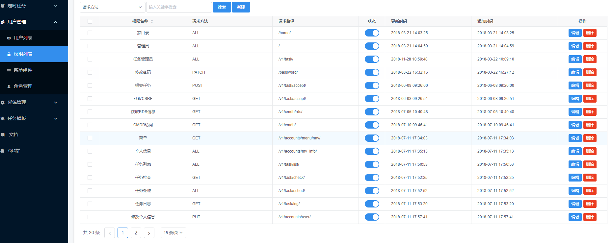
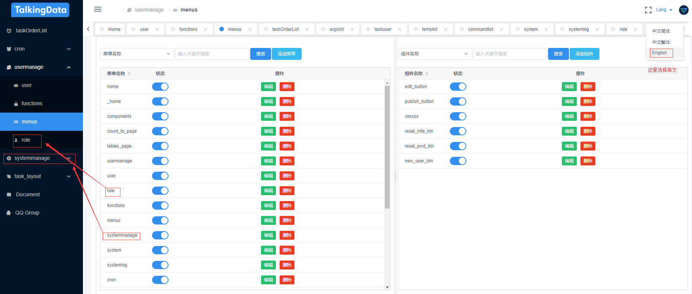
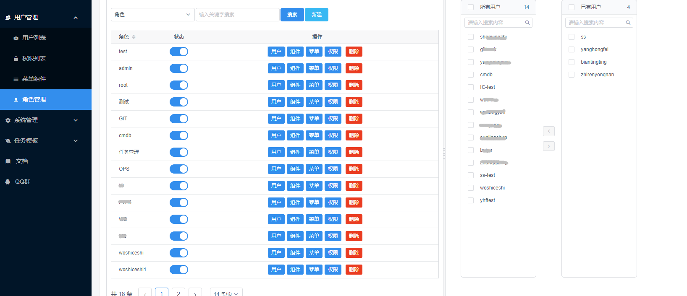
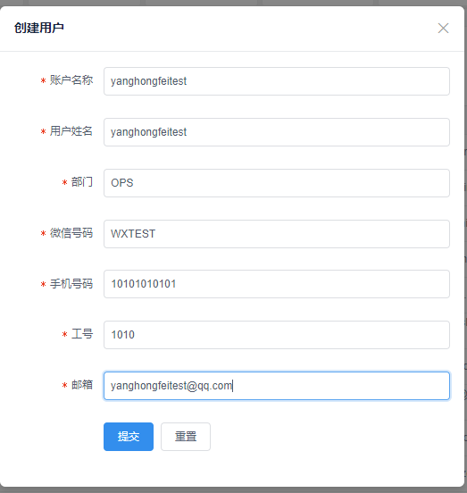
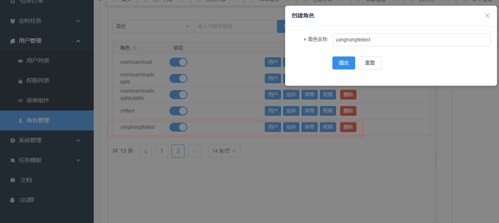
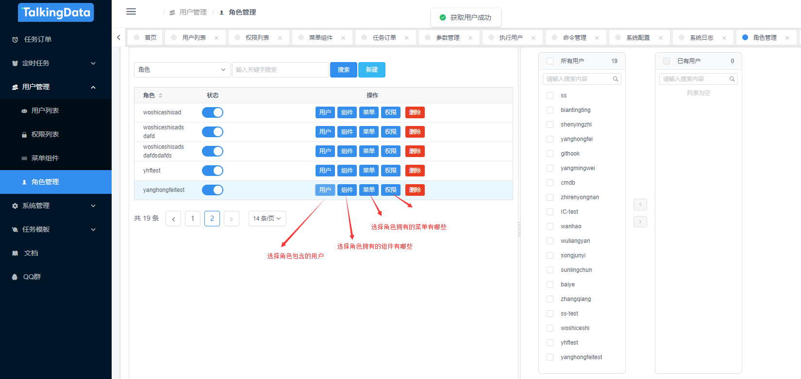
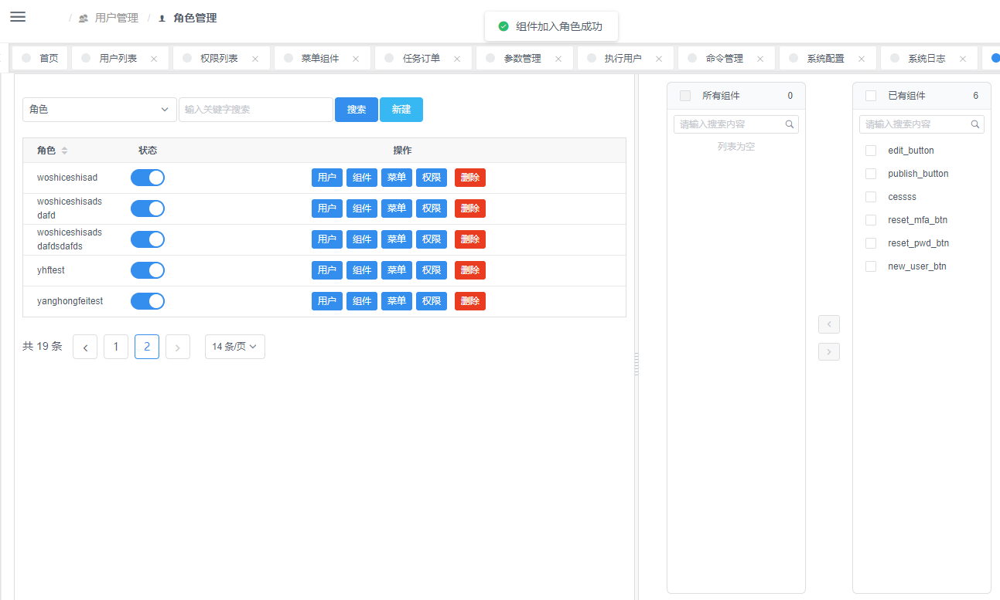
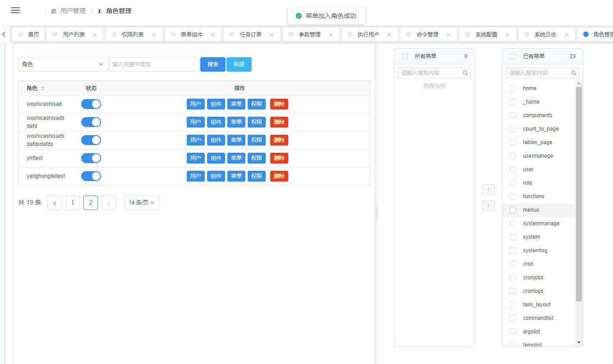
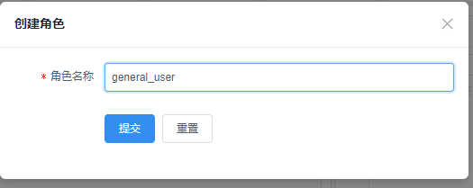
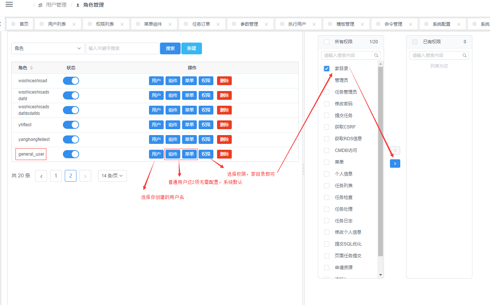

### 用户管理

> 这部分文档主要用来介绍用户管理，它可以很精细的管理你的用户权限

#### 1.1 用户列表

用户列表：顾名思义，用来管理和展示用户的列表，记录用户的详细信息

**功能支持**

- 搜索用户
- 新建用户
- 删除用户
- 关闭用户
- 重置密码
- 重置MFA（Google Authenticator）

**展示界面**

#### 1.2 权限列表

用来详细配置管理每个接口的权限，默认不需修改。

**注意事项**

- 系统默认已经配置了所有权限和方法，管理员默认拥有`/`权限，无需修改，以免造成系统请求某功能出错

**功能说明**

- 支持多种搜索方式，如：权限名称、请求路径、请求方法、时间等
- 支持新增、编辑、关闭、删除等操作权限的管理

- 支持新增自定义权限功能，适用于开发人员编写的API接口能很方便的接入进来权限管理划分

- 一些详细的API及使用文档正在支持更新中............

#### 1.3 菜单组件

菜单组件：顾名思义，也就是导航栏所看到的功能模块（如：用户管理、系统管理）和一些功能按钮（如：编辑、删除按钮），默认无需修改

**注意事项**

- 系统默认已经配置了所有菜单功能模块及组件，无需修改此项，以免造成访问出错。

**功能介绍**

列举以下几个菜单和组件进行介绍，字面英语也可看出含义，如下：

- home：家目录
- usermanage：用户管理
- cron：定时任务
- edit_button：编辑按钮

由于代码层面不好直接使用中文，你可以选择平台语言`English`，如下图，很清晰看到每个作用。

#### 1.4 角色管理

基于[RBAC](https://baike.baidu.com/item/RBAC/1328788?fr=aladdin)角色管理访问控制权限，可以很精细/方便的管理你的用户权限

**功能介绍**

- 角色的搜索、编辑、关闭、删除
- 自定义角色名字，自定义赋权组件、菜单、权限管理

- 列表可搜索赋权设计，方便用户可视化操作

#### 1.5 示例

示例介绍分为两部分，创建管理员用户赋权和创建普通用户赋权

##### 1.5.1 创建管理员示例

**新增用户**

点击用户列表---新增用户，输入信息

**用户赋权**

点击角色管理---新建，输入角色信息，选择角色进行赋权

##### 1.5.2 创建普通用户示例

**新建用户**  

同上，填写信息即可，详细权限管理全部在角色管理配置

**用户赋权**

